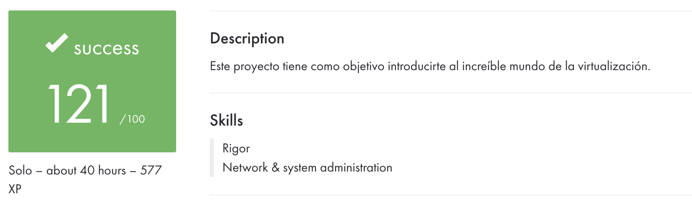
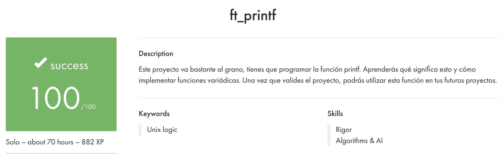
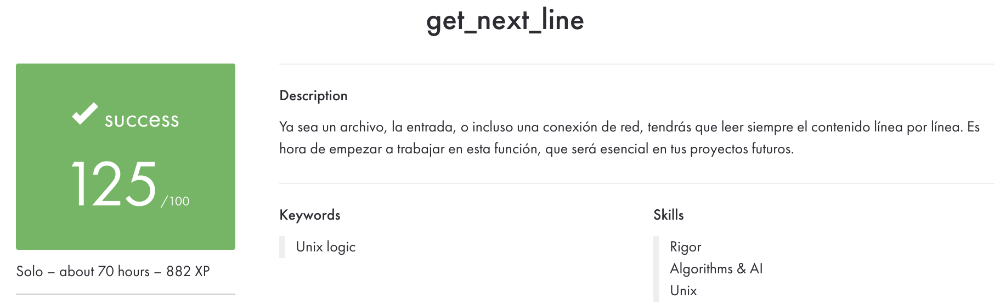

## <u>42 School Projects</u>

- [X] #**LIBFT**: a custom C standard library implementation that serves as the foundational component of the 42 School curriculum. It provides 43 utility functions across seven functional categories: character classification, string manipulation, memory management, type conversion, file I/O, string operations with allocation, and linked list operations. The library is designed to be reusable across subsequent 42 projects, replacing reliance on standard C library functions with student-implemented equivalents.

 
==

- [X] #**Born2BeRoot**: system administration project, which involves configuring a secure Debian Linux virtual machine running on VirtualBox. The project demonstrates fundamental system administration skills including OS installation, security hardening, and system monitoring implementation.

 
==

- [X] #**FT_PRINTF**: FT_PRINTF replicates the behavior of the standard printf() function by accepting a format string and a variable number of arguments. It parses the format string character-by-character, identifying format specifiers (indicated by % followed by a type character), and outputs the formatted result to standard output (file descriptor 1).

  | Specifier | Type         | Description              | Handler Function                     |   |
  |-----------|--------------|--------------------------|--------------------------------------|---|
  | %c        | int          | Single character         | ft_print_char()                      |   |
  | %s        | char*        | String (null-terminated) | ft_print_string()                    |   |
  | %d        | int          | Signed decimal integer   | ft_print_int()                       |   |
  | %i        | int          | Signed decimal integer   | ft_print_int()                       |   |
  | %u        | unsigned int | Unsigned decimal integer | ft_print_uint()                      |   |
  | %x        | unsigned int | Hexadecimal (lowercase)  | ft_print_hexa()                      |   |
  | %X        | unsigned int | Hexadecimal (uppercase)  | ft_print_hexa()                      |   |
  | %p        | void*        | Pointer address          | Special handling in ft_distributor() |   |
  | %%        | N/A          | Literal percent sign     | ft_print_char('%')                   |   |

  Special cases:

  - Null string pointers (%s with NULL) print (null)
  - Null pointers (%p with NULL) print (nil)
  - Pointer addresses are prefixed with 0x

 
==

- [X] #**GET NEXT LINE**: GET_NEXT_LINE is a file reading utility that returns one line at a time from a file descriptor, implementing efficient buffered I/O using static variable state management. This project teaches advanced C concepts including static variables, file descriptor operations, dynamic memory management, and buffer handling across multiple function calls.

 
==

- [X] #**EXAM RANK 02**: Success!!
 
