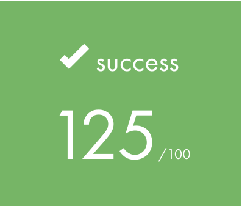

## <u>42 School Projects</u>

- [X] #**LIBFT**: a custom C standard library implementation that serves as the foundational component of the 42 School curriculum. It provides 43 utility functions across seven functional categories: character classification, string manipulation, memory management, type conversion, file I/O, string operations with allocation, and linked list operations. The library is designed to be reusable across subsequent 42 projects, replacing reliance on standard C library functions with student-implemented equivalents.

 
<br>
<br>
---
<br>

- [X] #**Born2BeRoot**: system administration project, which involves configuring a secure Debian Linux virtual machine running on VirtualBox. The project demonstrates fundamental system administration skills including OS installation, security hardening, and system monitoring implementation.

 
<br>
<br>
---
<br>

- [X] #**FT_PRINTF**: FT_PRINTF replicates the behavior of the standard printf() function by accepting a format string and a variable number of arguments. It parses the format string character-by-character, identifying format specifiers (indicated by % followed by a type character), and outputs the formatted result to standard output (file descriptor 1).

  | Specifier | Type         | Description              | Handler Function                     |   |
  |-----------|--------------|--------------------------|--------------------------------------|---|
  | %c        | int          | Single character         | ft_print_char()                      |   |
  | %s        | char*        | String (null-terminated) | ft_print_string()                    |   |
  | %d        | int          | Signed decimal integer   | ft_print_int()                       |   |
  | %i        | int          | Signed decimal integer   | ft_print_int()                       |   |
  | %u        | unsigned int | Unsigned decimal integer | ft_print_uint()                      |   |
  | %x        | unsigned int | Hexadecimal (lowercase)  | ft_print_hexa()                      |   |
  | %X        | unsigned int | Hexadecimal (uppercase)  | ft_print_hexa()                      |   |
  | %p        | void*        | Pointer address          | Special handling in ft_distributor() |   |
  | %%        | N/A          | Literal percent sign     | ft_print_char('%')                   |   |

  Special cases:

  - Null string pointers (%s with NULL) print (null)
  - Null pointers (%p with NULL) print (nil)
  - Pointer addresses are prefixed with 0x

 
<br>
<br>
---
<br>

- [X] #**GET NEXT LINE**: GET_NEXT_LINE is a file reading utility that returns one line at a time from a file descriptor, implementing efficient buffered I/O using static variable state management. This project teaches advanced C concepts including static variables, file descriptor operations, dynamic memory management, and buffer handling across multiple function calls.

 
<br>
<br>
---
<br>

- [X] #**EXAM RANK 02**: Success!!

<br>
<br>
---
<br>

- [X] #**PUSH_SWAP**: A sophisticated stack-based sorting algorithm implementation that sorts integers using two stacks and a limited set of operations. The program calculates and executes the cheapest sequence of moves (cost based model) to sort a given input, employing a greedy cost-optimization strategy.  
The architecture follows a pipeline structure: input validation → stack initialization → algorithmic sorting → operation output.

 

### List of allowed operations:

| Operation | Function | Behavior | Outputs |
| :--- | :--- | :--- | :--- |
| `sa` | `ft_swap(&stack_a, 'a')` | Swaps the first two nodes of stack_a | `sa` |
| `sb` | `ft_swap(&stack_b, 'b')` | Swaps the first two nodes of stack_b | `sb` |
| `pa` | `ft_push_a(&stack_a, &stack_b)` | Takes top of stack_b and puts it on top of stack_a | `pa` |
| `pb` | `ft_push_b(&stack_a, &stack_b)` | Takes top of stack_a and puts it on top of stack_b | `pb` |
| `ra` | `ft_rotate(&stack_a, 'a')` | Rotates stack_a up (first → last) | `ra` |
| `rb` | `ft_rotate(&stack_b, 'b')` | Rotates stack_b up (first → last) | `rb` |
| `rr` | `ft_rotate_2(&stack_a, &stack_b, 'r')` | Rotates both stacks up | `rr` |
| `rra` | `ft_rotate_r(&stack_a, 'a')` | Reverse rotates stack_a (last → first) | `rra` |
| `rrb` | `ft_rotate_r(&stack_b, 'b')` | Reverse rotates stack_b (last → first) | `rrb` |
| `rrr` | `ft_rotate_r_2(&stack_a, &stack_b, 'r')`| Reverse rotates both stacks | `rrr` |

### Build and Compilation
The push_swap project compiles into a single executable:

```make        # Builds push_swap executable```  
```make clean  # Removes object files```  
```make fclean # Removes object files and executable```  
```make re     # Rebuilds from scratch```  

### Usage
./push_swap [list of integers]

Examples:

```./push_swap 2 1 3 6 5 8```  
```./push_swap "3 2 1"```  
```./push_swap "1 2 3 4"  # Already sorted, no output```  
<br>
<br>
---
<br>

- [X] #**SO_LONG**: a 2D graphical game implementation using the MiniLibX library for window management and graphics rendering. The so_long project serves as an introduction to graphical programming in the 42 curriculum.

 


[](https://deepwiki.com/arlotetxu/42_cursus_reload)
